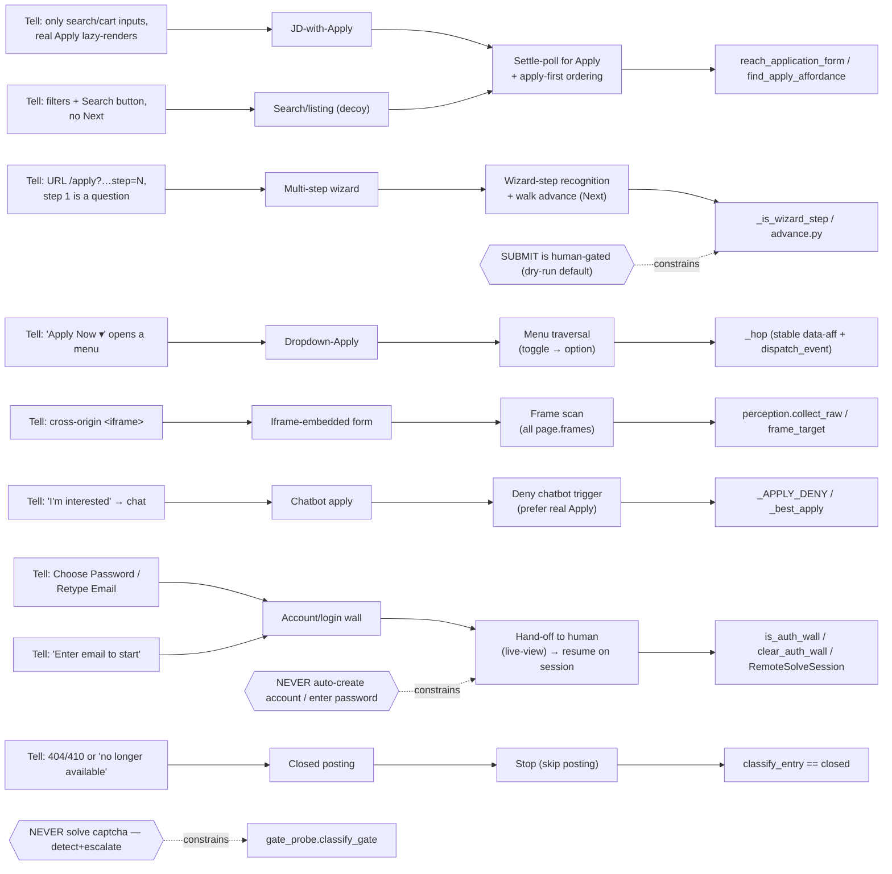

# Career-agent ATS knowledge graph

What we learned about *how job-application pages are shaped* and how the agent
handles each shape. The runtime logic lives in code (see the **Code** column);
this graph is the **map** — so a new session reasons about a fresh site by its
*tells*, not from scratch.

**How to use it:** land on a page → match a **Tell** → that gives the
**Archetype** → apply the **Strategy** → implemented in the named **Code**. A
real site is often a *composition* (e.g. ZF = dropdown-Apply → account-wall).

## Archetypes (nodes)

| Archetype | Tell (how to detect) | Strategy | Code |
|---|---|---|---|
| **Direct form** | name/email/résumé present on landing | fill it | `walk` |
| **JD-with-Apply** | only search/cart inputs; real Apply lazy-renders | poll for Apply, apply-first | `reach_application_form`, `find_apply_affordance` |
| **Multi-step wizard** | `/apply?…step=N`; step 1 may be a screening question | recognise wizard step, advance via Next | `_is_wizard_step`, `advance.py` |
| **Dropdown-Apply** | "Apply Now ▾" opens a menu; toggle changes no URL/fields | click toggle, then the revealed option (stable refs) | `_hop`, `_CLICKABLES_JS` |
| **Iframe-embedded** | real ATS in a cross-origin `<iframe>` | scan all frames; fill in-frame | `perception.collect_raw`, `frame_target` |
| **Chatbot apply** | "I'm interested" → conversational bot | deny the chatbot trigger, prefer real Apply (dialog mode = future) | `_APPLY_DENY` |
| **Account/login wall** | Choose-Password / Retype-Email / "Enter email to start" | hand off to human; resume on persisted session | `is_auth_wall`, `clear_auth_wall` |
| **Search/listing (decoy)** | filters + a *Search* button, no Next | not the form — keep drilling | `_is_wizard_step` returns False |
| **Closed posting** | 404/410, "no longer available" | stop / skip | `classify_entry` → `closed` |

## Vendors → archetypes (edges: IS-A / EXHIBITS)

| Vendor | Archetype(s) | Notes |
|---|---|---|
| **Phenom** (`jobs.*inc.com`, `jobs.thermofisher.com`) | JD-with-Apply → Multi-step wizard (+ chatbot decoy, + reCAPTCHA) | Apply lazy-renders; `/apply?…step=1..N`; résumé auto-parse |
| **SuccessFactors** (`career*.successfactors.*`) | Account/login wall | email + retype + **choose password** = signup |
| **Workday** (`*.myworkdayjobs.com`, some `jobs.*`) | Account wall / hard multi-step | often account-gated |
| **keka** (`*.keka.com`) | Direct form (JD → `applyjob/<id>`) | fills well (18/26 seen) |
| **contactrh / mynexthire** | redirect / iframe wrappers | contactrh→Workday; mynexthire iframed by careers.swiggy.com |
| **Lever / Greenhouse / Ashby** | Direct form (no login) | the easy, fillable class |

## Observed instances (edges: INSTANCE-OF)

| Site | Path | Outcome |
|---|---|---|
| eBay | Phenom → wizard | **submitted ✓** (5-step, résumé auto-parsed) |
| Thermo Fisher | Phenom → wizard | reached form; stopped at **reCAPTCHA** (escalate) |
| ZF | dropdown-Apply → **SuccessFactors** | reached account wall → hand-off |
| NetApp | **SuccessFactors** | account wall → hand-off |
| Societe Generale | custom login | account wall → hand-off |
| Swiggy | careers.swiggy.com → **mynexthire iframe** | frame-scan reaches apply route (SPA mount = residual) |
| Prismforce | keka | form, 18/26 |
| JumpCloud | Lever | direct form |

## Boundaries (invariants — never cross)

- **Never auto-create an account or enter a password** — account walls hand off to the human; the agent never generates/enters/stores credentials. Operator may wire `credential_provider` (their own code) — the agent ships it disabled.
- **Never solve a captcha** — `gate_probe` detects and escalates.
- **SUBMIT is human-gated** — `do_submit=False` by default; nothing auto-submits.
- **Essays are per-company** — not written to `AnswerMemory`; only stable answers are learned.
- **Secrets never committed**; PII stays local.

## Residual / open (edges: TODO)

- Chatbot-apply (Phenom "I'm interested") — needs a dialog-fill mode (not built).
- SPA mount-wait — Swiggy's mynexthire form mounts after the apply route.
- `phone` / `notice_period` profile-resolve gaps.
- Promote the interactive driver (`scratchpad/pipeline_test.py`) into the repo so the phone/hand-off flow + timeouts are committed config, not scratch.
