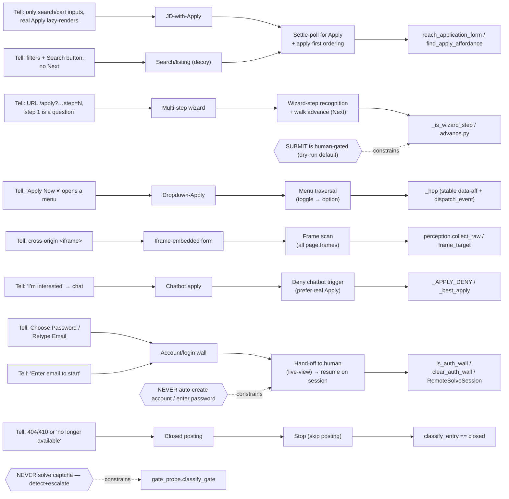

# Career-agent ATS knowledge graph

What we learned about *how job-application pages are shaped* and how the agent
handles each shape. The runtime logic lives in code (see the **Code** column);
this graph is the **map** — so a new session reasons about a fresh site by its
*tells*, not from scratch.

**How to use it:** land on a page → match a **Tell** → that gives the
**Archetype** → apply the **Strategy** → implemented in the named **Code**. A
real site is often a *composition* (e.g. ZF = dropdown-Apply → account-wall).



## Archetypes (nodes)

| Archetype | Tell (how to detect) | Strategy | Code |
|---|---|---|---|
| **Direct form** | name/email/résumé present on landing | fill it | `walk` |
| **JD-with-Apply** | only search/cart inputs; real Apply lazy-renders | poll for Apply, apply-first | `reach_application_form`, `find_apply_affordance` |
| **Multi-step wizard** | `/apply?…step=N`; step 1 may be a screening question | recognise wizard step, advance via Next | `_is_wizard_step`, `advance.py` |
| **Dropdown-Apply** | "Apply Now ▾" opens a menu; toggle changes no URL/fields | click toggle, then the revealed option (stable refs) | `_hop`, `_CLICKABLES_JS` |
| **Iframe-embedded** | real ATS in a cross-origin `<iframe>` | scan all frames; fill in-frame | `perception.collect_raw`, `frame_target` |
| **Chatbot apply** | "I'm interested" → conversational bot | deny the chatbot trigger, prefer real Apply (dialog mode = future) | `_APPLY_DENY` |
| **Account/login wall** | Choose-Password / Retype-Email / "Enter email to start" | hand off to human; resume on persisted session | `is_auth_wall`, `clear_auth_wall` |
| **Search/listing (decoy)** | filters + a *Search* button, no Next | not the form — keep drilling | `_is_wizard_step` returns False |
| **Closed posting** | 404/410, "no longer available" | stop / skip | `classify_entry` → `closed` |

## Vendors → archetypes (edges: IS-A / EXHIBITS)

| Vendor | Archetype(s) | Notes |
|---|---|---|
| **Phenom/eightfold** (`careers.qualcomm.com`, `jobs.*inc.com`, `jobs.thermofisher.com`) | JD-with-Apply → email-first login modal → OTP → registration/app form | Apply lazy-renders; email-first modal (`_is_email_first`); OTP via `confirm@eightfold.ai`; OTP boxes: `input[class*="numberInput" i]` (no maxlength); autocomplete="one-time-code" false positive on phone/address fields — require OTP text in body |
| **SuccessFactors** (`career*.successfactors.*`) | Account/login wall | email + retype + **choose password** = signup |
| **Workday** (`*.myworkdayjobs.com`, some `jobs.*`) | Account wall / hard multi-step | often account-gated |
| **keka** (`*.keka.com`) | Direct form (JD → `applyjob/<id>`) | fills well (18/26 seen) |
| **contactrh / mynexthire** | redirect / iframe wrappers | contactrh→Workday; mynexthire iframed by careers.swiggy.com |
| **Lever / Greenhouse / Ashby** | Direct form (no login) | the easy, fillable class |
| **SmartRecruiters (OneClick)** | Direct form — SPL web components | shadow DOM fill via JS evaluate; `spl-dropzone` file upload via Playwright chained locator |
| **SmartRecruiters (non-OneClick)** | Account/login wall | JD page has "Apply" button → SR login/register modal; credential_provider handles it; all 5 collected instances are now expired — SR has largely migrated companies to OneClick |
| **Workable** | Direct form (multi-step wizard) | Standard fields fill (6–14); custom YES/NO screening questions labelled by internal ID (`QA_\d+`) fixed by structural fallback in `groupLabel()`; Cookiebot banner (Accept all / Save settings) dismissed by `dismiss_consent()` |

## SmartRecruiters OneClick — web component tells & fixes

SR's OneClick Easy Apply form (`/oneclick-ui/`) uses SPL (SmartRecruiters Pattern Library) custom elements.
Every interactive field lives inside a shadow root — standard CSS selectors and `page.fill()` silently fail.

### Component map

| Ref seen in form model | Host element (main DOM) | Shadow path to `<input>` | Fix |
|---|---|---|---|
| `#first-name-input` | `<spl-input id="first-name-input">` | host.shadowRoot → `<input>` | `_SHADOW_FILL_JS` |
| `#last-name-input` | `<spl-input id="last-name-input">` | host.shadowRoot → `<input>` | `_SHADOW_FILL_JS` |
| `#email-input` | `<spl-input id="email-input">` | host.shadowRoot → `<input>` | `_SHADOW_FILL_JS` |
| `#confirm-email-input` | same pattern | same | `_SHADOW_FILL_JS` |
| `#linkedin-input` etc. | same pattern | same | `_SHADOW_FILL_JS` |
| `#spl-form-element_5` | `<spl-phone-field id="spl-form-element_5">` | host.shadowRoot → `<spl-input>` → `<spl-input>.shadowRoot → <input>` **(3 levels)** | `_SHADOW_FILL_JS` with `findInput()` deep search |
| `#spl-form-element_10` | `<spl-autocomplete>` → `<spl-input>` | autocomplete shadow → spl-input shadow → `<input>` | combobox: `get_by_label().click()` to open, then option click |
| `#file-input` | `<spl-dropzone>` | host.shadowRoot → `<input type="file">` | `locator("spl-dropzone").locator("input[type=file]").first.set_input_files()` |
| `#hiring-manager-message-input` | `<spl-textarea>` | host.shadowRoot → `<textarea>` | `_SHADOW_FILL_JS` |

### Which SR variant is this?

SR has two distinct apply paths — detect before running the fill loop:

| Variant | Tell | Perception | Action |
|---|---|---|---|
| **OneClick Easy Apply** | JD page shows "Easy Apply" badge; auto-redirects to `/oneclick-ui/company/<V>/publication/<uuid>` | 3 frames (oneclick-ui + LinkedIn talentwidget + about:blank) | Fill with `_SHADOW_FILL_JS` — works 10/10 |
| **Non-OneClick / account-gated** | JD page has "Apply" button → opens SR login/register modal | 1 frame (JD page only, no redirect) | `credential_provider` handles via `_route_reach` → `cred_provide` → `reach` loop; SR migrating companies to OC — all 5 collected instances expired as of 2026-09 |

From 10 SR jobs tested: **5 OneClick ✓, 5 non-OneClick (account-gated) ✗ (all 5 expired as of 2026-09; SR migrating all companies to OneClick)**

### Key tells (OneClick variant)

- URL: `jobs.smartrecruiters.com/oneclick-ui/company/<Vendor>/publication/<uuid>`
- Form contains `<spl-input>`, `<spl-dropzone>`, `<spl-phone-field>`, `<spl-autocomplete>`, `<spl-textarea>` custom elements
- 3 frames: main SR page + LinkedIn talentwidget iframe + about:blank

### Noise to filter (add to `_NOISE_RE`)

- `vendor-search-handler` — city autocomplete sub-widget (not a fillable field; SR handles city via `spl-autocomplete`)
- `upload profile image` — avatar photo uploader (not a resume upload)
- Cookie consent buttons, OneTrust overlay — not application fields

### Submit button

SR labels the submit button **"Send"** (not "Submit Application"). Add `"send"` and `"send application"` to `SUBMIT_NAMES`.
Block **"Apply With LinkedIn"**, **"Apply With Indeed"**, **"Apply with SEEK"** — OAuth shortcuts, not the real submit. Add `"apply with"` to `NEVER_NAMES`.

### Remaining gaps (open)

- **Phone country code**: `spl-phone-field` stores `{country}` separately from the number. DOM fill sets the number (`inpValue: "7565052330"`) but the country code stays at the form's default (Romania +40). Need to select country from the `spl-dropdown-search` inside `spl-phone-field` before filling the number.
- **City autocomplete**: `get_by_label("City").click()` opens the input, but options only appear after typing. Need to type the city name first, then read and click options. City options are inside the shadow DOM — `[role=option]` search on the whole page may miss them.
- **Resume upload visual confirmation**: `set_input_files` via chained locator succeeds, but SR parses the resume asynchronously. Experience/Education sections auto-populate after a ~2s delay — check those sections, not the dropzone label, to verify the upload worked.

## Phenom/eightfold — email-first login tells & fixes

Phenom-powered sites (Qualcomm, ThermoFisher, etc.) use an email-first modal overlay before showing the application form. The credential flow is distinct from standard account walls.

### Flow

```
JD page → Apply → email-first modal (enter email → Continue)
  → OTP email from confirm@eightfold.ai (subject "Verify your email")
  → OTP form (6 numberInput boxes, type="text", maxlength absent)
  → Click "Verify"
  → IF new account: registration form (first name, last name, password)
  → Application form
```

### OTP form DOM

| Tell | Value |
|---|---|
| Input selector | `input[class*="numberInput" i]` (6 visible boxes) |
| Input type | `type="text"` (NOT `inputmode="numeric"`) |
| Maxlength | absent / `-1` — DO NOT use `maxlength="1"` selector |
| Fill strategy | click each box → `keyboard.type(digit, delay=50)` |
| Submit | click "Verify" / "Continue" |

### Gate probe false positive

Phenom sets `autocomplete="one-time-code"` on phone, address, city, and postal code inputs to suppress browser autofill — this looks like an OTP gate. `gate_probe.py` guards against this with a body-text check:

```js
// otp_email_field only fires if OTP text is present in the body
/check your email|enter the code|one.?time|otp|verification code|we (just )?sent/i.test(body)
```

### Gmail OTP

- Sender: `confirm@eightfold.ai`
- OTP validity: 15 minutes
- Rate limit: Phenom rate-limits new OTP sends when Continue is clicked multiple times quickly — use `after_epoch = now - 1800s` to find the last valid unread OTP
- Gmail token: `gmail.readonly` — `messages.modify` returns 403 (mark-as-read is wrapped in try/except)

### Credential save timing

Phenom flow is: email → Continue → **OTP state** (not registration directly). Credential must be saved when `state ∈ ("registration", "otp", "verify_email")`, not only on `state == "registration"`.

## Observed instances (edges: INSTANCE-OF)

| Site | Path | Outcome |
|---|---|---|
| eBay | Phenom → wizard | **submitted ✓** (5-step, résumé auto-parsed) |
| Thermo Fisher | Phenom → wizard | reached form; stopped at **reCAPTCHA** (escalate) |
| Qualcomm (AI Engineer) | **Phenom/eightfold** email-first | 14 filled, 0 escalated; `reached_submit_dry_run` ✓; email→OTP(`confirm@eightfold.ai`)→account creation→form |
| ZF | dropdown-Apply → **SuccessFactors** | reached account wall → hand-off |
| NetApp | **SuccessFactors** | account wall → hand-off |
| Societe Generale | custom login | account wall → hand-off |
| Swiggy | careers.swiggy.com → **mynexthire iframe** | frame-scan reaches apply route (SPA mount = residual) |
| Prismforce | keka | form, 18/26 |
| JumpCloud | Lever | direct form |
| Bosch (AI/ML Engineer) | **SmartRecruiters OneClick** | 10 filled, 0 escalated; `reached_submit_dry_run` ✓ |
| Nielsen (AI/ML Engineer II/III) | **SmartRecruiters OneClick** | 10 filled, 0 escalated; `reached_submit_dry_run` ✓ |
| Coface (Data Scientists / ML Engineers) | **SmartRecruiters OneClick** | 10 filled, 0 escalated; `reached_submit_dry_run` ✓ |
| Versant3 (Senior ML Engineer) | **SmartRecruiters OneClick** | 10 filled, 0 escalated; `reached_submit_dry_run` ✓ |
| Intuitive (Sr. ML Engineer) | **SmartRecruiters OneClick** | 10 filled, 0 escalated; `reached_submit_dry_run` ✓ |
| NielsenIQ (ML Engineer) | **SmartRecruiters non-OneClick** | 0 filled; human gate (account wall); timed out |
| Cint (AI/ML Engineer) | **SmartRecruiters non-OneClick** | 0 filled; human gate (account wall); timed out |
| Nielsen (ML Eng P2) | **SmartRecruiters non-OneClick** | 0 filled; human gate (account wall); timed out |
| nexthink (Senior AI/ML Engineer) | **SmartRecruiters non-OneClick** | 0 filled; human gate (account wall); timed out |
| Syngenta (ML Engineer) | **SmartRecruiters non-OneClick** | 0 filled; human gate (account wall); timed out |

## Boundaries (invariants — never cross)

- **Account walls are handled by `credential_provider`** — generates/saves password, registers or logs in (Darwinbox, Infosys, SmartRecruiters non-OC). Graph routes `reach → cred_provide → reach` when `reach_node` returns `kind="password"` (guarded by `cred_provided` flag to prevent loops).
- **Never solve a captcha** — `gate_probe` detects and escalates.
- **SUBMIT is human-gated** — `do_submit=False` by default; nothing auto-submits.
- **Essays are per-company** — not written to `AnswerMemory`; only stable answers are learned.
- **Secrets never committed**; PII stays local.

## Workable — findings

- **ATS**: Workable (SaaS multi-step direct form)
- **Cookie banner**: Cookiebot (`button:Accept all` / `button:Save settings`) — async-loaded JS banner; `dismiss_consent()` retry loop handles it
- **Screening questions**: YES/NO radio groups labelled with internal IDs (`QA_12336448` etc.) because Workable uses CSS modules (hashed class names don't match the known-class regex in `groupLabel()`). Fixed by structural fallback in `groupLabel()`: finds container with both text-only child and radio-input child.
- **Standard fields**: fill normally (name, email, phone, address, LinkedIn, resume, work auth, visa, experience answers)
- **Form steps**: wizard multi-step — advance via "Next" / "Submit Application"

## Residual / open (edges: TODO)

- Chatbot-apply (Phenom "I'm interested") — needs a dialog-fill mode (not built).
- SPA mount-wait — Swiggy's mynexthire form mounts after the apply route.
- `phone` / `notice_period` profile-resolve gaps.
- Promote the interactive driver (`scratchpad/pipeline_test.py`) into the repo so the phone/hand-off flow + timeouts are committed config, not scratch.
